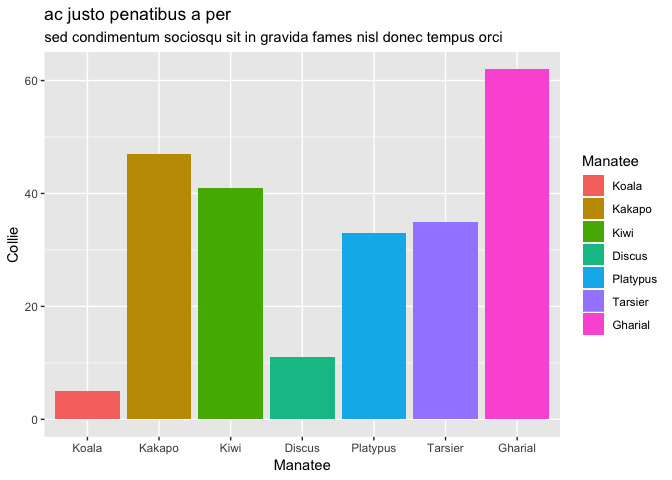
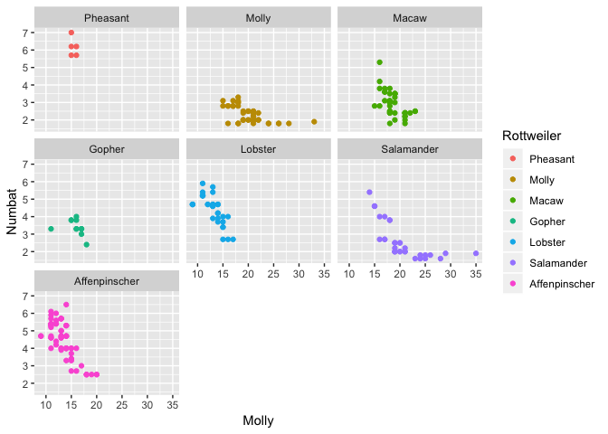

<!-- README.md is generated from README.Rmd. Please edit that file -->

# gganonymize

[](https://travis-ci.org/EmilHvitfeldt/gganonymize)

The goal of gganonymize is to anonymize the labels and text in a ggplot2
object in such a way that vizualizations about sensitive information can
more easily be shared and critiqued.

## Installation

You can install the development version from Github using `devtools`:

``` r
# install.packages("devtools")
devtools::install_github("EmilHvitfeldt/gganonymize")
```

## Examples

`gganonymize` will replace the text in the title, subtitle, caption and
tag with similar length text while ignoring numerics.

``` r
library(ggplot2)
library(gganonymize)

ggg <- ggplot(mtcars, aes(as.factor(cyl))) +
  geom_bar() +
  labs(title = "Test title",
       subtitle = "Test subtitle, this one have a lot lot lot lot lot more text then the rest",
       caption = "Test caption",
       tag = 1) +
  facet_wrap(~vs)

gganonomize(ggg)
```


It will respect names of of columns used in multiple settings such that
the legend will
match.

``` r
ggg <- ggplot(mtcars, aes(mpg, disp, color = disp, shape = factor(am))) +
  geom_point()

gganonomize(ggg)
```


Likewise will it sepect names in character/factor variables.

``` r
ggg <- ggplot(mpg, aes(class, fill = class)) +
  geom_bar() + 
  labs(title = "Super sensitive title",
       subtitle = "This part is even more sensitive, I hope no one will get to read it")

gganonomize(ggg)
```



and in facet labels.

``` r
ggg <- ggplot(mpg, aes(cty, displ, color = class)) +
  geom_point() +
  facet_wrap(~ class)

gganonomize(ggg)
```



This also extends to geom\_label,

``` r
ggg <- ggplot(iris, aes(Sepal.Length, Sepal.Width, label = Species)) +
  geom_label()

gganonomize(ggg)
```


and geom\_text.

``` r
ggg <- ggplot(iris, aes(Sepal.Length, Sepal.Width, label = Species)) +
  geom_text()

gganonomize(ggg)
```


## Now with as much mtcars as possible

``` r
ggg <- ggplot(mtcars, aes(as.factor(cyl))) +
  geom_bar() +
  labs(title = "Test title",
       subtitle = "Test subtitle, this one have a lot lot lot lot lot more text then the rest",
       caption = "Test caption",
       tag = 1) +
  facet_wrap(~vs)

mtcarsize(ggg)
```


